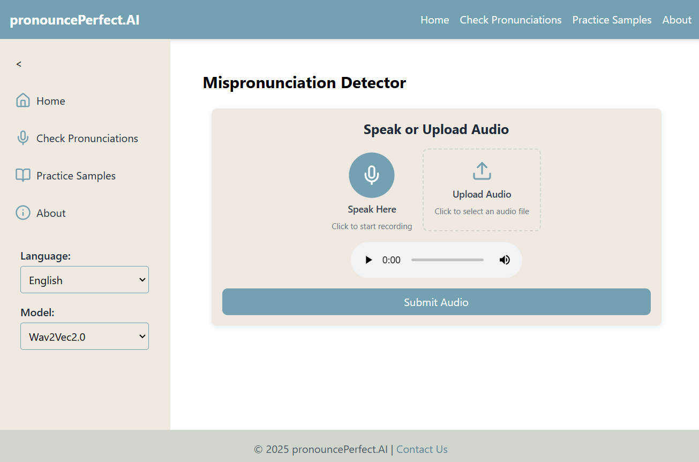

# PronouncePerfect

## Overview

PronouncePerfect is a web application designed to help users improve their pronunciation by recording audio, submitting text or audio inputs, and receiving transcriptions with pronunciation feedback.



The application is built with:
- **Backend**: Django + Django REST Framework (DRF)
- **Frontend**: React + Tailwind CSS
- **Audio Processing**: `ffmpeg` & `pydub`
- **Models**: Trained on `wav2vec2.0` and `whisper`.
- **Language Support** : `Nepali` and `English`

### **Key Features**

- **Audio Recording** – Record via microphone using the **MediaRecorder API**
- **Audio Upload** – Drag-and-drop pre-recorded files with a preview
- **Text Input & Pronunciation Check** – Compare audio transcriptions with user-provided text
- **Practice Mode** – Select database-driven text samples and receive feedback
- **Color-coded Transcriptions** – Green (correct), Red (incorrect)
- **Collapsible Sidebar & Responsive UI** – Mobile-friendly with intuitive navigation
- **Interactive UI:** Buttons for copying, editing, and removing transcriptions, with real-time state management.
- **Accessibility** – ARIA labels, keyboard navigation, WCAG 2.1 contrast compliance

## Prerequisites

Before you begin, ensure you have the following installed:

- **Python 3.8+**
- **Node.js 18+** (for React & Tailwind)
- **pip** (Python package manager)
- **virtualenv** (optional, for Python environment isolation)
- **Git** (for repository management and version control)
- **ffmpeg** (required for audio processing)

## **Installation**

### **1. Clone the Repository**

```bash
git clone https://github.com/your-username/pronouncePerfect.git
cd pronouncePerfect
```

### **2. Backend Setup (Django)**

#### **Create Virtual Environment**

```bash
python -m venv .venv
source .venv/bin/activate  
# On Windows, use 
`.venv\Scripts\activate`
```

#### **Install Dependencies**

```bash
pip install -r requirements.txt
```

> If `requirements.txt` is missing, generate it:

```bash
pip freeze > requirements.txt
```

### **3. Frontend Setup (React + Tailwind CSS)**

#### **Navigate to Frontend Directory**

```bash
cd frontend
```

#### **Install Dependencies**

```bash
npm install
```

#### **Initialize Vite for React**

```bash
npm create vite@latest . -- --template react
```

#### **Install Tailwind CSS**

```bash
npm install -D tailwindcss postcss autoprefixer
npx tailwindcss init -p
```

#### **Configure Tailwind** (`tailwind.config.js`)

```javascript
export default {
  content: ["./index.html", "./src/**/*.{js,jsx,ts,tsx}"],
  theme: {
    extend: {
      colors: {
        "pronounce-teal": "#2DD4BF",
        "pronounce-blue": "#2563EB",
      },
    },
  },
  plugins: [],
};
```

#### **Update Global Styles** (`index.css`)

```css
@tailwind base;
@tailwind components;
@tailwind utilities;
```

### **4. Install `ffmpeg` (Audio Processing)**

#### **Ubuntu/Debian**

```bash
sudo apt-get update
sudo apt-get install ffmpeg
```

#### **macOS**

```bash
brew install ffmpeg
```

#### **Windows**

Download **ffmpeg** from [ffmpeg.org](https://ffmpeg.org) and add it to your system PATH.

### **5. Configure Django Settings**

```bash
cp pronouncePerfect/settings/local.py.example pronouncePerfect/settings/local.py
```

Edit `local.py` to configure:

- **Database credentials**
- **Django secret key**
- **CORS settings** (for React frontend)

```python
CORS_ALLOWED_ORIGINS = ["http://localhost:5173"]
```

### **6. Apply Migrations**

```bash
python manage.py migrate
```

### **7. Create Superuser (Optional)**

```bash
python manage.py createsuperuser
```

### **8. Load Initial Data (Optional)**

```bash
python manage.py loaddata initial_data.json
```

### **9. Run Backend & Frontend**

#### **Backend (Django Server)**

```bash
cd ..  # Back to project root
python manage.py runserver
```

> Open in browser: [http://127.0.0.1:8000](http://127.0.0.1:8000)

#### **Frontend (React Dev Server)**

```bash
cd frontend
npm run dev
```

> Open in browser: [http://localhost:5173](http://localhost:5173)

---

## **Usage**

### Components

- **Audio Only:** Navigate to "Speak or Upload Audio," record via the microphone, or upload an audio file for transcription.
- **Audio + Text:** Use "Speak or Type Your Text" to record audio and provide text for comparison.
- **Audio Practice:** Select a sample text, record your pronunciation, and submit for transcription comparison.

### Transcription Feedback

- After submission, transcriptions appear with **color-coded feedback** (green for correct words, red for incorrect).
- Use the **"[Copy]"**, **"[Edit]"**, and **"[Remove]"** buttons to interact with transcriptions.

## Troubleshooting

- **Audio Not Recording:** Ensure your browser has microphone permissions and `ffmpeg` is installed.
- **Transcription Errors:** Check server logs for HTTP 500 errors.
- **Disabled Buttons:** Verify unique button IDs in `app.js`.

## Project Structure

### Backend

```
pronouncePerfect/
├── manage.py
├── pronouncePerfect/
│   ├── __init__.py
│   ├── settings/
│   │   ├── __init__.py
│   │   ├── base.py
│   │   ├── local.py
│   ├── urls.py
│   ├── wsgi.py
│   └── templates/
│       └── pronouncePerfect/
│           ├── components/
│               ├── speak_or_upload_audio.html
│               ├── text_input_component.html
│               ├── practice_on_samples.html
│               ├── transcription.html
├── static/
│   ├── pronouncePerfect/
│   │   ├── js/
│   │   │   ├── app.js
│   │   │   ├── audioRecorder.js
│   │   │   ├── audioSubmitter.js
│   │   │   ├── transcriptionUI.js
│   │   ├── css/
│   │   ├── images/
│   │   │   ├── sound_logo.jpg
├── requirements.txt
└── README.md
```

### Frontend

```
pronouncePerfect/
├── frontend/
│   ├── src/
│   │   ├── components/
│   │   │   ├── Footer.jsx
│   │   │   ├── Header.jsx
│   │   │   ├── Layout.jsx
│   │   │   ├── Main.jsx
│   │   │   ├── Sidebar.jsx
│   │   │   ├── AudioRecorder.jsx
│   │   │   ├── AudioSubmitter.jsx
│   │   │   ├── SubmitButton.jsx
│   │   │   └── SubmitOrUploadAudio.jsx
│   │   │   └── TranscriptionComponent.jsx
│   │   ├── pages/
│   │   │   ├── HomePage.jsx
│   │   │   ├── CheckPronunciationsPage.jsx
│   │   │   └── PracticeOnSamplesPage.jsx
│   │   ├── contexts/
│   │   │   ├── AudioContext.jsx
│   │   │   └── SidebarContext.jsx
│   │   ├── utils/
│   │   │   ├── css.js
│   │   │   ├── App.jsx
│   │   │   └── index.css
│   │   └── main.jsx
│   ├── public/
│   │   └── index.html
│   ├── package.json
│   ├── tailwind.config.js
│   └── postcss.config.js
├── static/
└── README.md
```

---

## Dependencies

### Python

- **Django >= 4.0**
- **pydub** (for audio processing)
- **ffmpeg-python** (optional)

### JavaScript

- Vanilla JavaScript [for React], supports modern browsers.

### NodeJs

### System

- **ffmpeg** (for audio processing)

## Contributing

1. **Fork** the repository.
2. Clone your fork:
   ```bash
   git clone https://github.com/your-username/pronouncePerfect.git
   cd pronouncePerfect
   ```
3. Create a virtual environment and install dependencies.
4. Create a new branch:
   ```bash
   git checkout -b feature/your-feature
   ```
5. Make your changes, ensuring code adheres to best practices.
6. Commit changes:
   ```bash
   git commit -m "Describe your changes"
   ```
7. Push to your fork and submit a **pull request**.

## Testing

Run Django tests:

```bash
python manage.py test
```

Manually test UI components in the browser.

## Code Style

- **Python:** Follow **PEP 8** guidelines.
- **JavaScript:** Use **camelCase** for variables and functions.

## Known Issues and Troubleshooting

- **Audio Processing Errors (HTTP 500):** Ensure `ffmpeg` is installed and configured.
- **Transcription Errors** Check **server logs** for HTTP 500 errors or CORS issues
- **React Not Loading Styles:** Ensure Tailwind is configured in `tailwind.config.js` & `index.css`
- **Timer Not Updating:** Verify `useEffect` dependencies in `AudioRecorder.jsx`
- **CSRF Error** -  set allowed origins to `'*'` or/and adjust these settings.
```python
  CSRF_COOKIE_SECURE = True 
  CSRF_COOKIE_HTTPONLY = False # Allow JavaScript to read the cookie
  CSRF_COOKIE_SAMESITE = 'None' 
  CORS_ALLOW_ALL_ORIGINS= True
```

## Browser Compatibility

Ensure your browser supports:

- **MediaRecorder API**
- **navigator.clipboard**
- **HTML5 Audio APIs**
